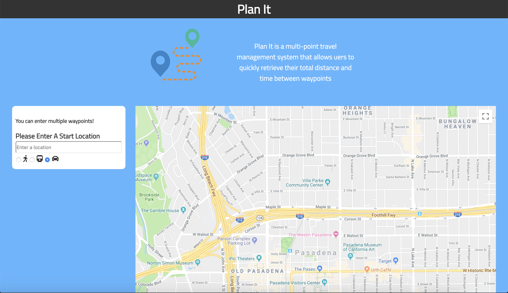
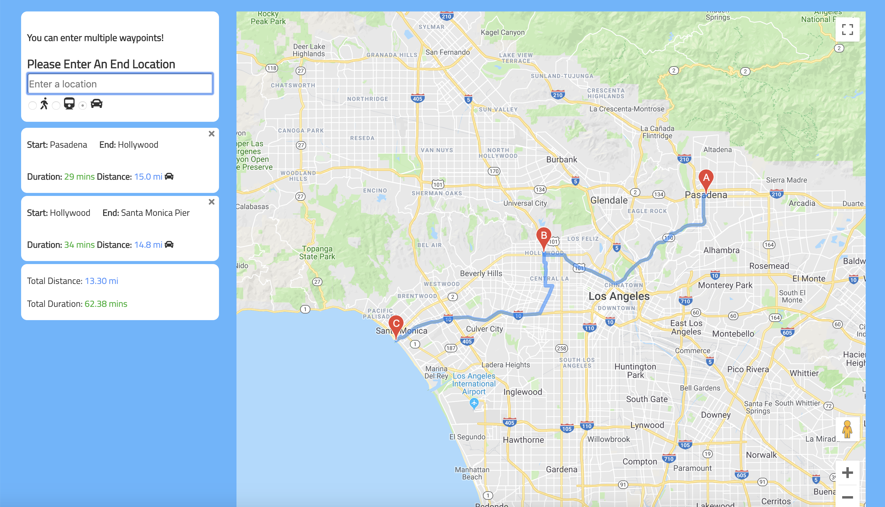

# PlanIt.io
This is an app that utilizes Google Maps to enable the user to plan trips. The app will automatically calculate and display the distance and duration between each destination that the user wishes to visit. In the end, the app will give the total duration and distance between all destinations that the user inputs. 

## Demo
https://martintirtawisata.github.io/PlanIt-GoogleMapsAPI/

## Screenshots

## Technology
HTML/CSS/JavaScript/jQuery/GoogleMapsAPI

## Authors
Martin Tirtawisata
